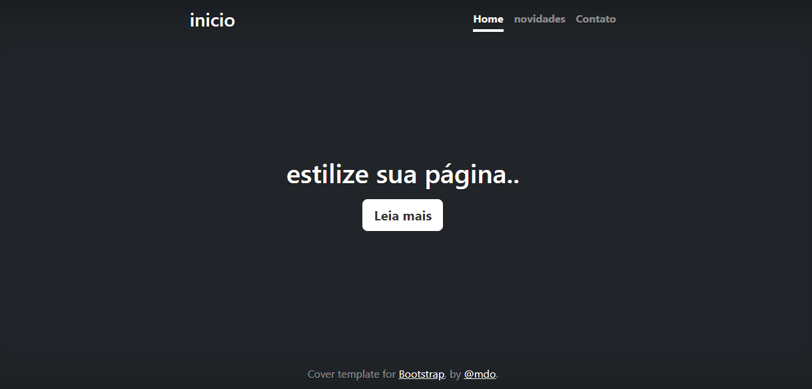
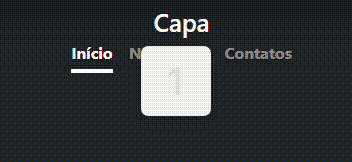
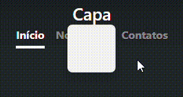

# Indice
 [Projeto - Apredendo a escrever um README](#projeto---apredendo-a-escrever-um-readme)  
 [Descrição](#descri%C3%A7%C3%A3o)  
[Introdução](#introdu%C3%A7%C3%A3o)  
[Funcionalidades](#funcionalidades)  
[Tecnologias ultilizadas](#tecnologias-ultilizadas)  
[Fontes consultadas](#fontes-consultadas)  
[Autores](#autores)  
# Projeto - Apredendo a escrever um README 
## Descrição
Uma página que serve como imagem de capa/menu onde terá as opções de "início", "Novidades" e "Contatos", além de contar com a opção "Ler Mais" que será usada para um texto muito grande.
Ao clicar em Início o usuário será direcionado para a capa/menu da página, onde estará o texto introdutivo sobre a página.
Ao clicar em Novidades o usuário será direcionado para o que há de novo na página, por exemplo, em um site de notícias, as "novidades" seriam as novas notícias ou reportagens postadas.
Ao clicar em Contatos o usuário será direcionado para a parte da página onde ele terá a opção de entrar em contato para
tirar dúvidas ou fazer criticas construtivas.
## Introdução

 

Parte inicial da página. Aqui é onde o usuário será direcionado caso selecione a opção "início" no topo da página.

 

 

Parte das novidades do site. É onde ficará as coisas novas, como novas opções e atualizações da página/site.

 

 

Parte dos "Contatos" do site. É onde ficará a parte para entrar em contato com os Autores da página através do "Entre em Contato", para assim tirar duvidas ou fazer critícas construtivas.ass
## Funcionalidades

 

**Novidades**: Redireciona o usuário para a página de novidades, onde são colocados todas as atualizações do portfólio.

 

 

**Contatos**: Redireciona o usuário para a página que contém formas de se comunicar com o administrador da página.

 

 

**Ler mais**: Redireciona o usuário para a página onde o ira contar com um texto explicativo sobre a capa

 

**Bootstrap**: Redireciona o usuário para o site oficial do [**bootstrap**](https://getbootstrap.com/)

 

**@mdo**: Redireciona o usuário para a página no twitter do criador da página. [**@mdo**](https://twitter.com/mdo)

 
### Tecnologias ultilizadas
Utilizamos o **HTML** para estruturar nossa página, incluindo texto e imagens. O **CSS** é responsável pelo design, como cores e layout. Juntos, eles tornam nossa página funcional e atraente.
## Fontes consultadas
Foram usadas o bootstrap para a estrutura inicial do site e o chat gpt para o melhoramento de textos e informações
também foi pedida a ajuda de nosso porfessor de programação web Leonardo rocha

links:

• https://getbootstrap.com/docs/5.0/examples/cover/

• https://leonardorocha.eti.br/

## Autores
 

[**_Danilo Felype Lima_**](https://github.com/DaniloFelype)

 

[**_Samuel Camargo de Farias_**](https://github.com/SamuelCmdeFarias)

 

[**_Leonardo Fernando Freire Gomes de Souza_**](https://github.com/ashuro-ryuki)